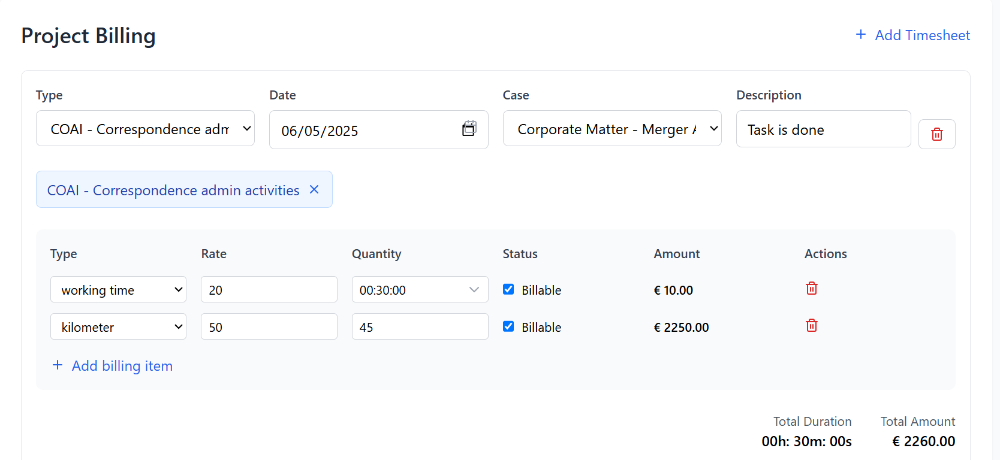

# 📋 Timesheet & Billing System (MERN Stack)

This is a MERN (MongoDB, Express.js, React, Node.js) based project developed to manage timesheets and billing efficiently for client-related tasks.

---

## 🛠 Features

### ✅ Add Timesheet

* Add timesheet entries for specific dates and projects.
* **Current Date** is automatically selected by default.
* Tasks can be associated with specific **Types** and **Cases**.
* Add a short **Description** for each task.
* UI Example:

  

---

### ✅ Add Billing

* Each timesheet entry supports adding billing items.

* Billing includes:

  * **Type** (e.g., working time, kilometer)
  * **Rate** per unit
  * **Quantity** (default is time; for "kilometer" type, quantity is in kilometers)
  * **Billable** checkbox to mark the item as chargeable

* **Amount** is automatically calculated as:

  ```
  Amount = Rate × Quantity
  ```

* **Total Amount** is the sum of all billing entries.

* Screenshot Example for Kilometer entry (📷 add this image):

  

---

## 📅 Technologies Used

* **Frontend**: React.js
* **Backend**: Node.js + Express.js
* **Database**: MongoDB

---

## 📌 Notes

* Clean and intuitive UI for task and billing management.
* Easily extendable for custom billing types or report generation.

---

## 🚀 Getting Started

Clone the repo and install dependencies:

```bash
git clone https://github.com/yourusername/timesheet-billing.git
cd timesheet-billing
npm install
npm start
```
